# Video Analysis and Validation Agent

An intelligent analysis agent that evaluates whether a Hercules test run was executed as planned. It compares the agent's planning log, video evidence, and final test output to detect deviations and provide detailed verification reports.

## 🎯 Overview

This agent performs post-execution analysis of browser automation tests to verify that each planned step was actually executed correctly. It uses a multi-evidence approach combining:

- **Browser Logs** — Execution confirmations from the test agent
- **Video Evidence** — OCR or LLM-based vision analysis of recorded sessions
- **Test Results** — JUnit XML outcomes and failure messages

---

## 📊 Analysis Flow

```mermaid
flowchart TD
    A[Test Artifacts] --> B[Find Artifacts]
    B --> C[Parse Plan Steps]
    B --> D[Extract Video Frames]
    B --> E[Load Browser Logs]
    
    C --> F[For Each Step]
    D --> F
    E --> F
    
    F --> G{Check Log Claims}
    G -->|Log Confirms Success| H[Observed ✅]
    G -->|Log Claims Execution| I{Visual Evidence?}
    G -->|No Claim| J{Check Termination}
    
    I -->|Found| H
    I -->|Not Found| K[Hallucinated 👻]
    
    J -->|After Termination Step| L[Deviation-Skipped ⏭️]
    J -->|Not Terminated| M{Visual Evidence?}
    
    M -->|Found| H
    M -->|Partial| N[Partially-Observed 🟡]
    M -->|None| O[Unclear ❓]
    
    H --> P[Generate Report]
    K --> P
    L --> P
    N --> P
    O --> P
    
    P --> Q[Deviation Report]
```



---

## 🔧 Features

### Core Analysis
- **Plan Extraction** — Parses Gherkin features, Hercules logs, or JUnit XML to extract test steps
- **Termination Detection** — Identifies when tests ended early and marks subsequent steps as skipped
- **Log-Based Verification** — Trusts browser execution confirmations when available
- **Visual Verification** — Vision LLM-based analysis of video frames
- **Asynchronous Pipeline** — Parallel processing of video frames (approx. 70% faster)

### Vision Analysis Options

| Mode | Description | When to Use |
|------|-------------|-------------|
| **OCR** (default) | Uses Tesseract for text extraction | Fast, no API costs, works offline |
| **Vision LLM** | Uses GPT-4V, Gemini, Claude, or Groq | More accurate, semantic understanding |

### Deviation Classification

Based on research from HALoGEN, BrowseComp, and HLE benchmarks:

| Status | Icon | Meaning |
|--------|------|---------|
| **Observed** | ✅ | Clear evidence (visual or log) confirms execution |
| **Partially-Observed** | 🟡 | Only some expected signals found |
| **Deviation-Skipped** | ⏭️ | Step was never executed (test terminated early) |
| **Deviation-Altered** | 🔀 | Executed differently than planned |
| **Hallucinated** | 👻 | Logs claim success but no confirmation found |
| **Unclear** | ❓ | Insufficient evidence to classify |

---

## 📁 Project Structure

```
Video_analysis_and_validation_agent/
├── analysis_agent.py          # Main orchestrator (includes PlanParser, VideoAnalyzer)
├── deviation_classifier.py    # 6-class taxonomy classification
├── vision_llm_analyzer.py     # LLM-based vision analysis
├── agents_llm_config.json     # API configuration for LLM providers
├── gherkin_files/             # Gherkin feature files
│   └── wrangler_product_search.feature
└── opt/
    ├── proofs/                # Video and screenshot evidence
    ├── log_files/             # Hercules execution logs
    └── output/                # Generated reports
```

---

## 🚀 Installation

### Prerequisites

- **Python 3.10+**
- **ffmpeg** (for video frame extraction)
- **tesseract** (for OCR - optional if using Vision LLM)

### macOS
```bash
brew install ffmpeg tesseract
```

### Ubuntu/Debian
```bash
sudo apt install ffmpeg tesseract-ocr
```

### Install Python Dependencies
```bash
cd Video_analysis_and_validation_agent
uv sync
```

---

## run herculus


## 1. Activate virtual environment
source .venv/bin/activate
## 2. Run Hercules
testzeus-hercules \
  --input-file gherkin_files/wrangler_product_search.feature \
  --output-path opt \
  --llm-config agents_llm_config.json \
  --save-recording-option always

## 💻 Usage

### Basic Usage (Auto-detects Latest Run)
```bash
uv run analysis_agent.py
```

### Specify Scenario and Run
```bash
uv run analysis_agent.py \
  --scenario "wrangler_test" \
  --run-id "run_20260104_050126" \
  --base-path "./opt"
```

### Analyze Flat Directory Structure
```bash
# For unstructured artifact directories (like supportingLogs)
uv run analysis_agent.py \
  --scenario "wrangler_test" \
  --run-id "supportingLogs" \
```

### With Vision LLM (Recommended for Accuracy)
```bash
uv run analysis_agent.py \
  --scenario "wrangler_test" \
  --run-id "supportingLogs" \
  --use-vision-llm \
  --vision-provider groq
```

### All Options
```bash
uv run analysis_agent.py --help

Options:
  --scenario SCENARIO          Scenario name
  --run-id RUN_ID              Run ID (e.g., run_20260104_043806)
  --base-path BASE_PATH        Base path to artifacts
  --gherkin GHERKIN_PATH       Path to .feature file for plan extraction
  --output-format {markdown,json}  Output format
  --output OUTPUT              Output file path
  --video-interval SECONDS     Frame sampling interval (default: 2.0)
  --no-video-sampling          Skip video frame extraction
  --use-vision-llm             Use LLM for vision analysis (more accurate)
  --vision-provider {openai,google,anthropic,groq}
                               LLM provider for vision analysis
```

---

## 🔌 Vision LLM Configuration

### Supported Providers

| Provider | Model | Vision Support |
|----------|-------|----------------|
| **Groq** | `meta-llama/llama-4-scout-17b-16e-instruct` | ✅ Yes |
| **OpenAI** | `gpt-4o` | ✅ Yes |
| **Google** | `gemini-1.5-pro` | ✅ Yes |
| **Anthropic** | `claude-3-sonnet` | ✅ Yes |

### Configuration File (`agents_llm_config.json`)

The Vision LLM Analyzer automatically loads API credentials from this file:

```json
{
  "groq": {
    "planner_agent": {
      "model_name": "openai/gpt-oss-120b",
      "model_api_key": "your-api-key-here",
      "model_base_url": "https://api.groq.com",
      "model_api_type": "groq"
    }
  }
}
```

> **Note:** For vision tasks, the analyzer automatically uses vision-capable models (e.g., `meta-llama/llama-4-scout-17b-16e-instruct` for Groq) regardless of the model specified in config. # this is for now

### Environment Variables (Alternative)
```bash
export GROQ_API_KEY="your-groq-api-key"
export OPENAI_API_KEY="your-openai-api-key"
export GOOGLE_API_KEY="your-google-api-key"
export ANTHROPIC_API_KEY="your-anthropic-api-key"
```

---

## 📂 Input Artifacts

### Structured Layout (Default Hercules Output)
```
opt/
├── proofs/
│   └── <scenario_name>/
│       └── <run_id>/
│           ├── videos/
│           │   └── video_of_<scenario>.webm
│           └── screenshots/
│               ├── click_start_*.png
│               └── click_end_*.png
├── log_files/
│   └── <scenario_name>/
│       └── <run_id>/
│           └── log_between_*.json
└── output/
    └── <run_id>/
        └── test_result.xml
```

### Flat Layout (Supported)
```
supportingLogs/
├── video.webm
├── agent_inner_logs.json
├── test_result.xml
└── *.png (screenshots)
```

---

## 📤 Output

### Report Location
Reports are written to `opt/output/deviation_report_<run_id>.md` by default, or to a custom path with `--output`.

### Sample Report

```markdown
# Deviation Report

- Scenario: wrangler_test
- Run ID: supportingLogs
- Steps analyzed: 10
- Deviations: 3
- Average confidence: 81.0%
- Status counts: Observed 7, Deviation-Skipped 3

## Final Output
- Failure message: EXPECTED RESULT: The 'Turtle Neck' filter option is available...
  ACTUAL RESULT: Only the 'Crew Neck' filter option is present...

## Step Results
| Step | Description | Result | Conf | Notes | Evidence |
| --- | --- | --- | --- | --- | --- |
| 1 | Navigate to the Wrangler website... | Observed | 75% | Browser logs confirm successful execution | - |
| 2 | Validate that the homepage loads... | Observed | 75% | Browser logs confirm successful execution | - |
| ... | ... | ... | ... | ... | ... |
| 8 | Validate that the filter is applied... | Deviation-Skipped | 95% | Test terminated early | - |
```

---

## 🏗️ Architecture


---

## 🔬 Classification Logic

### Evidence Hierarchy

1. **Log-Confirmed Success** → `Observed` (75% confidence)
   - Browser explicitly reports `COMPLETED_SUCCESSFULLY`
   
2. **Visual Evidence Found** → `Observed` (85%+ confidence)
   - OCR or LLM identifies expected elements

3. **Test Terminated Early** → `Deviation-Skipped` (95% confidence)
   - Step index > termination step

4. **Log Claims but No Confirmation** → `Hallucinated` (70% confidence)
   - Logs mention step but no success status

5. **No Evidence** → `Unclear` (30% confidence)
   - Insufficient data to classify

### Termination Detection

The agent detects when a test terminates early by:
1. Parsing browser response count in logs
2. Mapping responses to plan step numbers
3. Marking all subsequent steps as `Deviation-Skipped`

---

## 📚 Research Foundation

This agent's design is informed by:

| Research | Contribution |
|----------|--------------|
| **Fara-7B** | Structured action schemas for computer use |
| **HALoGEN** | Hallucination detection methodology |
| **BrowseComp** | Browsing agent evaluation criteria |
| **DeepSeek OCR** | Vision pipeline for text extraction |
| **HLE Benchmark** | Hard evaluation standards for agents |

---

## 🚀 Running Hercules Tests

### Quick Start
```bash
# Run a Gherkin feature file with Hercules
source .venv/bin/activate
testzeus-hercules \
  --input-file gherkin_files/nike_product_search.feature \
  --output-path opt \
  --llm-config agents_llm_config.json \
  --save-recording-option always
```

### With Increased Timeouts (Recommended for Complex Sites)
```bash
testzeus-hercules \
  --input-file gherkin_files/nike_product_search.feature \
  --output-path opt \
  --llm-config agents_llm_config.json \
  --save-recording-option always \
  --wait-timeout 30 \
  --navigation-timeout 60
```

### Available Feature Files
| Feature | Description |
|---------|-------------|
| `wrangler_product_search.feature` | Search products on Wrangler and apply filters |
| `nike_product_search.feature` | Search black running shoes on Nike.in, check size 10 |

### Test Output Artifacts
After running a test, artifacts are saved in:
```
opt/
├── proofs/<scenario_name>/<run_id>/
│   └── videos/video_of_<scenario>.webm
├── log_files/<scenario_name>/<run_id>/
│   └── log_between_*.json
└── output/<run_id>/
    ├── <feature>_result.xml (JUnit)
    └── <feature>_result.html (Visual Report)
```

---

## 🧪 Example: Analyzing Wrangler Test

```bash
# 1. Ensure you have the supporting logs
ls -la ../supportingLogs/
# video.webm  agent_inner_logs.json  test_result.xml  ...

# 2. Run analysis with Vision LLM
uv run analysis_agent.py \
  --scenario "wrangler_test" \
  --run-id "supportingLogs" \
  --base-path "../supportingLogs" \
  --use-vision-llm \
  --vision-provider groq \
  --output wrangler_report.md

# 3. Review the report
cat wrangler_report.md
```

---

## 🛠️ Troubleshooting

### "No proofs directory found"
Specify `--scenario` and `--run-id` manually when using flat directory structures.

### Vision LLM errors
- Ensure API key is configured in `agents_llm_config.json` or environment
- Check that the model supports vision (text-only models won't work)
- Verify the base URL is correct for your provider

### OCR not detecting text
- Increase video sampling rate with `--video-interval 1.0`
- Try using Vision LLM for better semantic understanding
- Check that tesseract is installed: `tesseract --version`

---

## 📄 License

MIT

---

## 🤝 Contributing

Contributions welcome! Please ensure tests pass and update documentation for new features.
